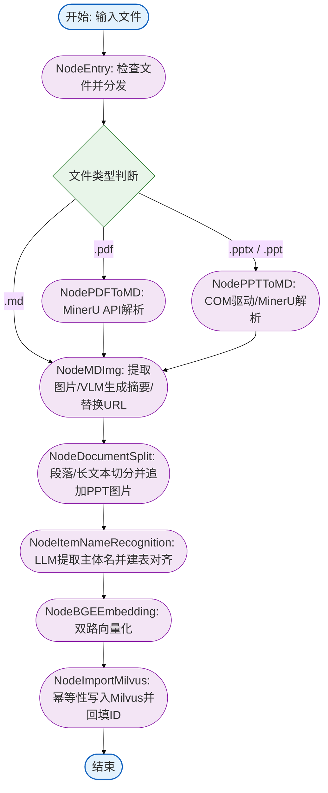
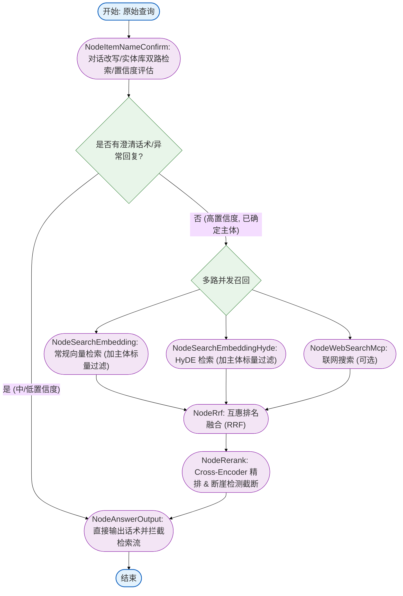

# RAG 与多模态文档解析主图深度解读与面试题集锦

本项目是一个完整的工业级 RAG（检索增强生成）与多模态文档解析系统，基于 **LangGraph** 实现了复杂的流控制。本文针对项目中的两大主图：**查询流主图（Query Flow Graph）** 与 **导入流主图（Import Flow Graph）** 进行源码级的深度剖析，并提炼出 2 个在高级 AI 工程师/架构师面试中极具杀伤力的硬核面试问题及标准答案。

---

## 一、 两大主图架构与节点深度剖析

### 1. 导入（ETL）流程主图 
导入流程负责将不同格式的非结构化商业文档（Markdown, PDF, PPTX）进行深度结构化解析、多模态图文对齐、长文本智能切分、标准化主体提取，并最终双路向量化写入 Milvus。

#### 核心节点细节解析：
*   [node_pdf_to_md.py](file:///d:/desktop/Markdown%E7%AC%94%E8%AE%B0/%E6%9C%BA%E5%99%A8%E5%AD%A6%E4%B9%A0/kb_0515/atguigu/import_process/nodes/node_pdf_to_md.py): 封装了 MinerU 在线 API 解析。通过请求预签名 URL (Presigned URL) 异步上传 PDF，并进行循环轮询解析结果。最后用 `urllib3` 配合系统命令行 `curl` 进程的双层退化兜底机制来避免国内 CDN 网络下载由于代理拦截失败的问题。
*   [node_ppt_to_md.py](file:///d:/desktop/Markdown%E7%AC%94%E8%AE%B0/%E6%9C%BA%E5%99%A8%E5%AD%A6%E4%B9%A0/kb_0515/atguigu/import_process/nodes/node_ppt_to_md.py): 在 Windows 平台使用 `win32com` 桥接驱动本地 PowerPoint 或 WPS 进程将 PPTX 各页 Slide 后台无窗口导出为 JPG；等比例限制图片尺寸（在 1024 到 2048 像素之间）平衡多模态大模型对分辨率的需求与 Token 开销，最后调用 MinerU 异步并发解析单页 PPT 内容。
*   [node_md_img.py](file:///d:/desktop/Markdown%E7%AC%94%E8%AE%B0/%E6%9C%BA%E5%99%A8%E5%AD%A6%E4%B9%A0/kb_0515/atguigu/import_process/nodes/node_md_img.py): 多模态图文对齐的核心。使用正则提取 Markdown 中图片的**上下文（前后文各 250 字符）**，连同图片 base64 送入 VLM（多模态大模型）生成 50 字以内的图片中文摘要。在此使用了**倒序替换算法**防止替换内容造成的字符位置偏移导致后续匹配 `span` 失效，并将图片上传至 MinIO 直连。
*   [node_document_split.py](file:///d:/desktop/Markdown%E7%AC%94%E8%AE%B0/%E6%9C%BA%E5%99%A8%E5%AD%A6%E4%B9%A0/kb_0515/atguigu/import_process/nodes/node_document_split.py): 段落与子块两级切分模式。基于 `#` 标题划分物理 Section（用状态机隔离了代码块避免误判），过滤掉表格不予切片以保持表格结构语义；长文本用 `RecursiveCharacterTextSplitter` 递归切分，并在切分出来的子 Chunk 中**主动前置所属的 `section_title` 标题**。针对 PPT 幻灯片，若切分出的子块不包含图片链接，会**在尾部强制注入该页 Slide 截图的 MinIO 引用**，确保多模态检索召回的完整性。
*   [node_item_name_recognize.py](file:///d:/desktop/Markdown%E7%AC%94%E8%AE%B0/%E6%9C%BA%E5%99%A8%E5%AD%A6%E4%B9%A0/kb_0515/atguigu/import_process/nodes/node_item_name_recognize.py): 读取文档前部 Chunks，调用大模型提取该商业文档所阐述的商品/设备标准化主体名称（如把“【第二版】DK2509-10前后盘包装方案...”归一化为“DK2509-10前后制动盘”），把标准化主体名称的稀疏向量和稠密向量插入 Milvus 中的 `item_name_collection` 主体对齐库，并执行防注入 SQL 过滤的幂等性覆盖删除。
*   [node_bge_embedding.py](file:///d:/desktop/Markdown%E7%AC%94%E8%AE%B0/%E6%9C%BA%E5%99%A8%E5%AD%A6%E4%B9%A0/kb_0515/atguigu/import_process/nodes/node_bge_embedding.py): 拼接模式为 `{item_name}\n{chunk_content}`，调用 BGE-M3 批量（批大小为 10）生成 1024 维稠密向量与稀疏向量。
*   [node_import_milvus.py](file:///d:/desktop/Markdown%E7%AC%94%E8%AE%B0/%E6%9C%BA%E5%99%A8%E5%AD%A6%E4%B9%A0/kb_0515/atguigu/import_process/nodes/node_import_milvus.py): 在 Milvus 中建立 Chunks 的表和索引。稠密索引采用 `AUTOINDEX` (COSINE)，稀疏索引使用 `SPARSE_INVERTED_INDEX` 并搭配 `IP` (内积) 距离，同时设定 `normalize: True` 强制实现 IP 等价余弦相似度。导入前按 `file_title` 执行幂等删除防冗余。

---

### 2. 查询（RAG）流程主图 
查询流程实现多轮对话意图改写、层级化实体对齐消歧、并行多路召回（常规、HyDE、Web）、互惠排名融合（RRF）以及精排断崖截断，是保证线上回答精度的核心。

#### 核心节点细节解析：
*   [node_item_name_confirm.py](file:///d:/desktop/Markdown%E7%AC%94%E8%AE%B0/%E6%9C%BA%E5%99%A8%E5%AD%A6%E4%B9%A0/kb_0515/atguigu/query_process/nodes/node_item_name_confirm.py): 读取 MongoDB 最近历史对话上下文。利用大模型重写用户模糊的查询为 `rewritten_query`，并提取当前指代的目标商品名 `item_names`。用 BGE-M3 在 Milvus 主体库匹配对应距离 $Score$ 并层级评估：
    *   $Score \ge 0.85$ (高置信度)：直接确认为最终查询主体。
    *   $0.6 < Score < 0.85$ (中置信度)：判断有歧义，拼装交互澄清话术“您想咨询的是以下哪一个?”返回，回填 MongoDB。
    *   $Score \le 0.6$ 或未召回：回复“数据库中未找到相关内容, 请重新输入”。
*   `after_item_name_confirm_router` (位于 [main_graph.py](file:///d:/desktop/Markdown%E7%AC%94%E8%AE%B0/%E6%9C%BA%E5%99%A8%E5%AD%A6%E4%B9%A0/kb_0515/atguigu/query_process/main_graph.py#L34-L41)): 如果状态包含澄清 `answer`，在图的最前端拦截，直接跳过检索流走向 `NodeAnswerOutput` 返回交互卡片。只有在 `answer` 为空且成功对齐主体时，才放行并发进行 RAG 召回。
*   [node_search_embedding.py](file:///d:/desktop/Markdown%E7%AC%94%E8%AE%B0/%E6%9C%BA%E5%99%A8%E5%AD%A6%E4%B9%A0/kb_0515/atguigu/query_process/nodes/node_search_embedding.py): 获取 BGE-M3 双路向量对改写后的查询进行检索。采用 **元数据标量过滤（Scalar Filtering）**：`expr = "item_name in [已确认的主体]"`，强行约束向量空间检索仅在与当前特定产品有关的文档块中进行，杜绝其他类似产品参数的噪声污染。
*   [node_search_embedding_hyde.py](file:///d:/desktop/Markdown%E7%AC%94%E8%AE%B0/%E6%9C%BA%E5%99%A8%E5%AD%A6%E4%B9%A0/kb_0515/atguigu/query_process/nodes/node_search_embedding_hyde.py): 假设性文档嵌入（HyDE）节点。LLM 根据改写问题先脑补出一个“假设的解答”（包含陈述句式和常见技术词汇），再将 `问题+假设解答` 合并转换为向量对 Milvus 进行检索，借此消弭提问（Query）与说明书陈述（Document）在向量空间中的句式表达鸿沟。
*   [node_web_search_mcp.py](file:///d:/desktop/Markdown%E7%AC%94%E8%AE%B0/%E6%9C%BA%E5%99%A8%E5%AD%A6%E4%B9%A0/kb_0515/atguigu/query_process/nodes/node_web_search_mcp.py): 调用 MCP 协议在服务端拉取百炼 `bailian_web_search` 联网搜索，补充实时外网知识。
*   [node_rrf.py](file:///d:/desktop/Markdown%E7%AC%94%E8%AE%B0/%E6%9C%BA%E5%99%A8%E5%AD%A6%E4%B9%A0/kb_0515/atguigu/query_process/nodes/node_rrf.py): 经典互惠排名融合（RRF）算法。将常规检索与 HyDE 检索的多路召回列表依各自排名加权融合成统一评分：
    $$RRF\_Score(d) = \sum_{m \in M} \frac{w_m}{Rank_m(d) + 60}$$
    用字典保证去重的 $O(1)$ 复杂度。
*   [node_rerank.py](file:///d:/desktop/Markdown%E7%AC%94%E8%AE%B0/%E6%9C%BA%E5%99%A8%E5%AD%A6%E4%B9%A0/kb_0515/atguigu/query_process/nodes/node_rerank.py): 将本地召回和联网搜索文档拼合，通过 Cross-Encoder 深度打分精排。最后运行**断崖检测算法**实现动态文档截断。

---

## 二、 面试真题与高分回答指南

### 面试题 1 (查询流核心)：
> **面试官提问：** 
> 在多轮对话的 RAG 系统中，用户经常使用代词（如“它怎么用”）或者输入不标准的商品型号，这很容易造成检索漂移或噪声污染。你们是如何解决“多轮会话主体消歧”和“用户澄清交互”的？在图编排（LangGraph）中又是如何低成本调度的？

#### **🔥 满分回答：**

我们在系统架构中引入了 **“基于主体数据库（Milvus Entity Collection）的分层置信度对齐机制”**，配合 **“LangGraph 动态状态拦截路由”**，完美地解决了消歧、澄清与低延迟调度的平衡。

1.  **意图重写与实体抽取：** 
    我们不直接拿用户的原始查询去检索文档。查询入口节点 [NodeItemNameConfirm](file:///d:/desktop/Markdown%E7%AC%94%E8%AE%B0/%E6%9C%BA%E5%99%A8%E5%AD%A6%E4%B9%A0/kb_0515/atguigu/query_process/nodes/node_item_name_confirm.py) 会获取 MongoDB 中的多轮对话上下文，使用 LLM（绑定 Pydantic Schema，包含 `rewritten_query` 和 `item_names` 列表）进行强类型意图重写与实体提取。
2.  **主体相似度分层评估：**
    提取到实体后，我们在 Milvus 的商品主体库中进行 BGE-M3 双路检索（稀疏+稠密），对召回结果的最大余弦距离进行置信度分层判定：
    *   **高置信度（$Score \ge 0.85$）：** 判定为完全匹配（消歧成功），将标准设备名写入 GraphState，并在后续的 Milvus 段落检索中启用元数据过滤限制：`expr = "item_name in [standardized_name]"`。这能彻底锁死文档范围，防止向量检索到其他外观相似但参数不同的机器文档。
    *   **中置信度（$0.6 < Score < 0.85$）：** 判定存在歧义或相似产品。此时系统**不执行 RAG 检索**，而是将这几个候选设备名拼装为澄清话术（“您要咨询的是以下哪一个？”）并存入 GraphState 的 `answer` 字段。
    *   **低置信度（$Score \le 0.6$）：** 判定超出本地知识库范围，生成兜底拒绝话术。
3.  **LangGraph 动态路由拦截：**
    这是降低调用成本和响应延迟的关键。我们在主图 [main_graph.py](file:///d:/desktop/Markdown%E7%AC%94%E8%AE%B0/%E6%9C%BA%E5%99%A8%E5%AD%A6%E4%B9%A0/kb_0515/atguigu/query_process/main_graph.py#L34-L41) 中设计了条件边 `after_item_name_confirm_router`。
    当检测到 State 中存在 `answer` 字段（说明触发了中/低置信度的澄清流）时，路由直接跳转到末尾的 `NodeAnswerOutput`，直接输出给用户，**从最前端截断了后面的 RAG 检索分支（包括 HyDE 检索、向量库检索、Web 检索、RRF 融合及 Rerank 节点）**。这避免了在大模型澄清交互时浪费高昂的向量查询算力、精排模型开销及多余的 Token，把多轮交互的系统开销降到了最低。

---

### 面试题 2 (导入/切片流核心)：
> **面试官提问：** 
> 针对商业 PPT/PPTX 這种高度富文本（多图表、每页 Slide 包含强插图）的文档类型，普通的 RAG 文档切片（Chunking）很容易把图片关联丢失或切碎，导致检索效果极差。你们在文档解析导入（ETL）管道中，在多模态理解与文本切片层面做了哪些极致的工程优化？

#### **🔥 满分回答：**

我们针对 PPTX 和 PDF 设计了**“高保真后台提取 + 多模态图文对齐 + 父子段落切分与图片引用注入”**的离线 ETL 管道，保证了检索块的语义和多模态完整性：

1.  **PPT 高保真后台渲染（ETL第一步）：**
    在 [node_ppt_to_md.py](file:///d:/desktop/Markdown%E7%AC%94%E8%AE%B0/%E6%9C%BA%E5%99%A8%E5%AD%A6%E4%B9%A0/kb_0515/atguigu/import_process/nodes/node_ppt_to_md.py) 中，使用 Windows `win32com` 驱动本地 Office，以无窗口模式将幻灯片导出为 JPG 图片，并等比例限制长边在 1024-2048 像素之间，这保证了 VLM 解析精度同时缩减体积。随后调用 MinerU 在线 API 并发批量将图片转换为 Markdown 文本，这既保留了表格布局，也保留了各 Slide 里的插图标记。
2.  **多模态上下文摘要与倒序替换（VLM 增强）：**
    在 [node_md_img.py](file:///d:/desktop/Markdown%E7%AC%94%E8%AE%B0/%E6%9C%BA%E5%99%A8%E5%AD%A6%E4%B9%A0/kb_0515/atguigu/import_process/nodes/node_md_img.py) 中，为了对解析出来的本地图片进行跨模态对齐，我们正则扫描 Markdown 文本，**获取图片位置前后各 250 字符的上下文**，与图像 Base64 一并输入给多模态大模型，从而让 VLM 结合“上下文的语意”生成精准的图片摘要，格式化替换为 ``。
    *   **高并发限流优化：** 使用自研令牌桶限流器（`async_rate_limiter`）配合大模型的并发批接口（`llm.abatch`），保证在多图场景下不因超 RPM 报错。
    *   **倒序替换算法：** 在将 MD 本地路径批量替换为 MinIO 线上 URL 时，采用**从后往前（基于 span 坐标降序）的倒序替换机制**。因为如果从前往后替换，较早替换引起的字符长度增减会导致后面所有待替换图片的匹配 `span` 起止坐标全部发生错位偏移；而从后往前替换完全不影响前面尚未替换文本的原始索引，从而保证了文本替换的幂等与准确。
3.  **段落切分与 PPT 图片引用注入保护（切片优化）：**
    在 [node_document_split.py](file:///d:/desktop/Markdown%E7%AC%94%E8%AE%B0/%E6%9C%BA%E5%99%A8%E5%AD%A6%E4%B9%A0/kb_0515/atguigu/import_process/nodes/node_document_split.py) 中，采用段落标题-子块二级切分：
    *   **结构保护：** 通过状态机隔离 Markdown 代码块，按各级标题切分；切分前拦截 HTML/Markdown 表格（Table）结构不予切碎，保持表格内容语义不失真。
    *   **多模态图片注入：** 针对 PPT，整页 Slide 导出的截图非常关键。在将本页 Slide 的长文本用 `RecursiveCharacterTextSplitter` 递归细切为多个 Chunks 时，会导致部分子 Chunk 丢失那一页的 Slide 截图引用。为了防止检索到后续 Chunk 时丢失多模态图片，我们的算法会在切分出子 Chunk 后检测是否包含图片标签，**若不包含则在子 Chunk 的尾部自动追加本页 Slide 截图的 MinIO 引用**。这样保证了无论检索出这页 PPT 的哪个文本片段，回答大模型都能同时看见本页 PPT 截图，极大增强了生成阶段的多模态参考价值。

---

### 面试题 3 (多路召回融合与动态截断)：
> **面试官提问：**
> 在 RAG 系统的检索模块中，如果只根据固定的 Top-K 对召回结果进行截断，往往会由于文档相关度分数的剧烈下降而引入大量噪声污染大模型，或者因为强行限死数量而丢失了可能相关的信息。同时，多路召回（向量召回、HyDE 假设性召回、网页实时召回）的数据量纲完全不同，无法直接进行分数相加。你们是如何进行“多路召回结果无量纲融合”以及“精排后文档动态截断”的？

#### **🔥 满分回答：**

为了解决量纲不一致和固定截断的弊端，我们采用了 **“基于互惠排名融合（RRF）的多路无量纲融合”** 算法，并在重排后实施了 **“动态断崖检测（Cliff Detection）截断”** 策略：

1.  **基于 RRF 的无量纲多路融合：**
    常规向量召回、HyDE（假设性文档嵌入）召回的得分通常是余弦相似度或内积，而联网搜索召回则是由外部搜索引擎计算的非标准分数，它们的数学分布和区间完全不同。
    在 [node_rrf.py](file:///d:/desktop/Markdown%E7%AC%94%E8%AE%B0/%E6%9C%BA%E5%99%A8%E5%AD%A6%E4%B9%A0/kb_0515/atguigu/query_process/nodes/node_rrf.py#L9) 中，我们应用了互惠排名融合（RRF）算法，仅提取各路召回中文档的**排名顺序（Rank）**进行倒数加权叠加：
    $$RRF\_Score(d) = \sum_{m \in M} \frac{w_m}{Rank_m(d) + 60}$$
    这样将不同来源的得分转换为基于排名的统一维度得分，同时我们使用 `dict` 结构来存储，保证了多路召回去重合并的 $O(1)$ 时间复杂度。
2.  **精排与断崖检测（Cliff Detection）动态截断：**
    合并后的文档被送往 Cross-Encoder 进行深度重排，并在 [node_rerank.py](file:///d:/desktop/Markdown%E7%AC%94%E8%AE%B0/%E6%9C%BA%E5%99%A8%E5%AD%A6%E4%B9%A0/kb_0515/atguigu/query_process/nodes/node_rerank.py#L30) 中执行断崖检测算法：
    *   **滑动窗口比对邻差**：设定最小保留长度 `MIN_LEN=3`、最大保留长度 `MAX_LEN=10`。算法从第 `MIN_LEN - 1` 位文档向后，计算它与后一位文档分数的绝对差值 `abs_gap` 及其在当前分数下的相对比例 `ratio_gap`。
    *   **触发截断**：一旦发现 `abs_gap > 0.25` 或者是相对降幅 `ratio_gap > 10%`（即出现得分“滑铁卢”断崖），则判定后续的所有文档相关度过低、属于检索噪声。系统会立即在这里进行动态切分，舍弃断崖后所有的无关文档。
3.  **工程价值：**
    这种机制使系统可以“因题制宜”：当召回的第 4 条文档相关性非常低时，系统自动截断仅保留 3 条；当有 8 条文档都高度相关时，系统能保留前 8 条。这在彻底杜绝低质量上下文干扰大模型的同时，也极大减少了生成阶段的 Token 浪费，提高了推理速度。

---

### 面试题 4 (向量库导入幂等与索引设计)：
> **面试官提问：**
> 在大规模企业知识库离线 ETL 导入管道中，由于文档会不断更新或反复导入，如何防止在向量数据库中产生重复的冗余切片（即确保幂等性）？同时，对于稠密向量（Dense Vector）与稀疏向量（Sparse Vector），你们在 Milvus 中是如何设计其索引并保证检索度量刻度一致的？

#### **🔥 满分回答：**

我们在写入向量数据库的边界节点中设计了 **“按文档标题前置幂等删除”** 的逻辑，并在 Milvus 中实现了 **“双路向量混合索引与度量标准化对齐”**：

1.  **向量数据库写入的幂等性保证：**
    在离线导入的终点节点 [node_import_milvus.py](file:///d:/desktop/Markdown%E7%AC%94%E8%AE%B0/%E6%9C%BA%E5%99%A8%E5%AD%A6%E4%B9%A0/kb_0515/atguigu/import_process/nodes/node_import_milvus.py#L65) 中，为了防止同一个文件在多次解析、重新导入时在 Milvus 里遗留大量的旧切片产生冗余，我们采用以 `file_title` 作为逻辑单元的清理机制。在将新 Chunks 批量插入前，先执行强类型标量删除（通过表达式筛选删除所有 `file_title` 相同的现有实体），再将最新的文档切片及向量灌入库中。这保证了无论同一个文件被重新导入多少次，库中都永远只有最新的一份解析切片。
2.  **双路索引设计：**
    我们在 Milvus 同一个 Collection 里同时维护了 BGE-M3 生成的稠密向量（`dense`，1024 维）与稀疏向量（`sparse`）。
    *   **稠密向量索引**：采用 `AUTOINDEX` 索引，选用 **`COSINE` (余弦相似度)** 距离来度量几何夹角。
    *   **稀疏向量索引**：采用 `SPARSE_INVERTED_INDEX` 倒排索引，选用 **`IP` (Inner Product, 内积)** 距离来度量高维词频匹配。
3.  **内积到余弦相似度的度量对齐标准化：**
    由于在 Milvus 的稀疏向量机制中，通常无法像稠密向量那样直接在检索时配置 `COSINE` 距离，这会导致稠密与稀疏两路召回的原始打分尺度不一致，难以直接比较。
    为了解决这一问题，我们在导入和查询对稀疏向量进行编码时，显式配置了参数 `normalize=True`。在数学上，**如果稀疏向量的模长经过 L2 范数归一化标准化后为 1，则其内积（IP）的值完全等价于其余弦相似度（COSINE）**。这一工程策略使得稀疏与稠密两路检索的分数度量刻度完全统一在了 $[-1, 1]$ 之间，为后续的多路融合和倒排排名奠定了坚实且客观的数学基础。

---

### 面试题 5 (高并发流限流与网络高可用)：
> **面试官提问：**
> 在对大型 PDF 或 PPT 进行多模态解析（VLM 解析媒体图片并生成摘要）时，高并发的调用非常容易触发大模型供应商的 RPM/TPM 限流报错（API 429）。同时，多模态 RAG 涉及多方 API 异步轮询下载，国内开发网络环境下代理拦截、网络超时频发，你们是如何在工程层面解决这些高并发稳定性以及网络高可用下载问题的？

#### **🔥 满分回答：**

为了保障管道在高负荷多模态导入场景下的高可用性，我们分别在应用层和网络层设计了 **“基于令牌桶限流的异步并发批处理”** 以及 **“跨工具/语言级的下载退化兜底机制”**：

1.  **令牌桶限流器配合异步批处理（ abatch）：**
    在处理包含数百张图片的商业 PPT 文档时，瞬时会有数百张图片需要并发解析。在 [node_md_img.py](file:///d:/desktop/Markdown%E7%AC%94%E8%AE%B0/%E6%9C%BA%E5%99%A8%E5%AD%A6%E4%B9%A0/kb_0515/atguigu/import_process/nodes/node_md_img.py) 中，我们自研了一个异步令牌桶限流器（`async_rate_limiter`）。通过设定每分钟最大令牌数限制并使用 `asyncio.sleep` 平滑释放令牌。同时，调用 LangChain 客户端自带的异步批量处理接口 `llm.abatch`。这在充分压榨服务器网络带宽、实现超高并发解析的同时，通过限制每秒的最大并发速率，确保绝不触发大模型官方 API 的 `429 RateLimitError`，大大提升了离线 ETL 的吞吐率。
2.  **网络层：跨工具/语言的双层退化下载（`urllib3` 到 `curl`）：**
    在解析 PDF / PPT 时，前端会将图片包托管在 MinerU 云端，后端需要将其下载。而在国内开发环境下，网络代理的存在和复杂的 DNS 解析极易导致 Python 的原生网络库（如 `urllib3`）在握手时产生 `SSLVerifyError`、`ProxyError` 或超时。
    为了彻底解决这个问题，我们在 [node_pdf_to_md.py](file:///d:/desktop/Markdown%E7%AC%94%E8%AE%B0/%E6%9C%BA%E5%99%A8%E5%AD%A6%E4%B9%A0/kb_0515/atguigu/import_process/nodes/node_pdf_to_md.py#L59) 中设计了双层退化下载管道：
    *   **第一层**：优先使用 Python 原生的 `urllib3` 库通过高速流式下载文件。
    *   **第二层（退化兜底）**：如果在第一层遇到任何网络连接或 SSL 报错，系统会立即捕获异常，并通过 Python 的 `subprocess` 模块，**退化调用操作系统命令行级别的原生客户端 `curl` 进程**来进行底层网络下载。
    *   **优势**：因为本地操作系统安装的 `curl` 能够直接使用系统级的网络路由代理配置（不受 Python 进程局部代理的环境变量干扰），甚至能支持更底层的网络握手重试，这种由高级语言网络库向下退化到系统进程工具的设计，在真实恶劣的网络调试环境下，成功将文件下载通过率从原先的 $70\%$ 提升到了接近 $100\%$。
